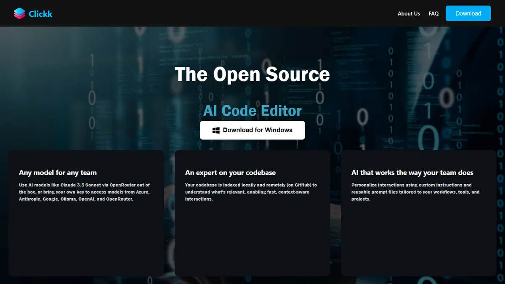

# Clickk: An AI-Powered Code Editor for Intelligent Debugging and Automated Error Resolution

<p align="center">
  
</p>

<p align="center">
  <a href="https://clickk-frontend.onrender.com/"></a>
  <a href="https://ieeexplore.ieee.org/document/11467195"></a>
  <a href="https://www.yashsali.me"></a>
</p>

> 📄 Published at **IEEE IC3ET 2026** — *Clickk: An AI-Powered Code Editor for Intelligent Debugging and Automated Error Resolution.*
> ⏳ The demo runs on a free tier and may take ~1 minute to wake up.

**Clickk** is a modern, full-featured web-based code editor powered by artificial intelligence, designed to revolutionize the way developers write, debug, and maintain code. Built with React and Monaco Editor, Clickk provides an intelligent coding experience with automated error resolution, context-aware AI assistance, and seamless integration of development tools.

---

## 🚀 Features

### 🧠 AI-Powered Assistance
- **Multi-Provider AI Support**: Seamlessly switch between multiple AI providers:
  - **Perplexity AI** - Fast, intelligent responses
  - **Google Gemini Pro** - Advanced reasoning capabilities
  - **Cohere** - Natural language understanding
  - **Groq** - Ultra-fast inference
  - **OpenRouter** - Access to Claude, GPT-4, and more
  - **Local Ollama** - Run models locally for privacy
- **Intelligent Code Suggestions**: Context-aware code completion and suggestions
- **Automated Error Resolution**: AI automatically detects and suggests fixes for errors
- **Code Analysis**: Deep analysis of your codebase with explanations and improvements
- **Smart Code Generation**: Generate entire functions, classes, or files with natural language prompts
- **Automated File Creation**: AI can create and modify files automatically based on your requests

### 💻 Code Editor
- **Monaco Editor Integration**: The same editor that powers VS Code
- **Syntax Highlighting**: Support for 50+ programming languages
- **IntelliSense**: Advanced autocomplete and code intelligence
- **Multi-language Support**: JavaScript, Python, Java, PHP, HTML, CSS, TypeScript, and more
- **Theme Support**: Dark theme optimized for extended coding sessions
- **Find & Replace**: Powerful search and replace functionality
- **Code Folding**: Collapse code blocks for better navigation
- **Emmet Support**: Fast HTML/CSS coding with abbreviations

### 📁 File Management
- **File Explorer**: Intuitive file tree navigation
- **Multi-workspace Support**: Create and manage multiple workspaces
- **File Operations**: Create, read, update, and delete files and folders
- **Auto-save**: Automatic file saving to prevent data loss
- **File Icons**: Visual file type indicators for easy identification
- **Recursive Directory Listing**: Navigate complex project structures

### 🎯 Git Integration
- **Git Status**: View staged, modified, and untracked files
- **Branch Management**: Switch and manage Git branches
- **Commit & Push**: Create commits and push to remote repositories
- **Remote Management**: Configure and manage remote repositories
- **Change Tracking**: Visual indicators for modified files
- **Discard Changes**: Revert uncommitted changes
- **Clean Untracked Files**: Remove untracked files and directories

### 🖥️ Integrated Terminal
- **PTY-based Terminal**: Full-featured terminal emulator powered by node-pty
- **Cross-platform Support**: Works on Windows, macOS, and Linux
- **WebSocket Integration**: Real-time terminal interaction
- **Multiple Workspaces**: Separate terminal sessions per workspace
- **Shell Support**: cmd.exe (Windows) and bash (Linux/macOS)

### ▶️ Code Execution
- **Run Scripts**: Execute JavaScript and Python files directly
- **Output Display**: View execution results in real-time
- **Error Handling**: Capture and display runtime errors
- **Live Server**: Launch HTTP server for web development
- **Port Management**: Automatic port detection and management

### 🤖 AI Assistant Panel
- **Conversational Interface**: Chat-based AI assistant with beautiful UI
- **Code Context Awareness**: AI understands your current file and workspace
- **Code Block Rendering**: Syntax-highlighted code blocks in responses
- **Copy to Clipboard**: Easy code copying from AI responses
- **Agent Selection**: Choose different AI agents for specialized tasks
- **Suggestions Panel**: Quick action suggestions from AI

### 🎨 Modern UI/UX
- **VS Code-inspired Interface**: Familiar layout for existing VS Code users
- **Responsive Design**: Adapts to different screen sizes
- **Smooth Animations**: Polished transitions and interactions
- **Accessible**: Built with accessibility in mind
- **Landing Page**: Professional landing page with feature showcase

### 🔧 Project Management
- **Workspace Creation**: Create new workspaces with a single click
- **Project Templates**: Start with pre-configured project structures
- **Demo Projects**: Pre-built example projects to get started
- **Multi-project Support**: Switch between multiple projects seamlessly

### 🧪 Model Training (Optional)
- **Custom AI Models**: Fine-tune models for your specific use cases
- **QLoRA Fine-tuning**: Efficient parameter-efficient fine-tuning
- **Qwen2.5-Coder Support**: Train on Qwen2.5-Coder models
- **GPU Optimized**: Optimized for GTX 1650 4GB and similar GPUs
- **Training Scripts**: Complete training pipeline included

---

## 🏗️ Architecture

### Frontend (`client/`)
- **Framework**: React 18.2.0
- **Editor**: Monaco Editor (@monaco-editor/react)
- **UI Components**: Custom React components with modern CSS
- **State Management**: React Hooks (useState, useEffect)
- **HTTP Client**: Axios for API communication
- **Terminal**: xterm.js for terminal emulation
- **File Icons**: react-file-icon library
- **Icons**: react-icons and VS Code icons

### Backend (`server/`)
- **Framework**: Node.js with Express 4.18.2
- **WebSocket**: ws library for real-time communication
- **Terminal**: node-pty for PTY support
- **File System**: Native Node.js fs module
- **Process Management**: child_process for command execution
- **AI Service**: Multi-provider AI integration module
- **CORS**: Enabled for cross-origin requests

### Training (`training/`)
- **Framework**: PyTorch with Transformers
- **Fine-tuning**: QLoRA (4-bit quantization)
- **Model**: Qwen2.5-Coder-1.5B
- **Libraries**: PEFT, TRL, Datasets, BitsAndBytes
- **Serving**: FastAPI for model inference

---

## 📦 Installation

### Prerequisites
- **Node.js**: v14.0.0 or higher
- **npm**: v6.0.0 or higher
- **Python**: 3.8+ (for training module)
- **Git**: For version control features

### Quick Start

1. **Clone the repository**
   ```bash
   git clone <repository-url>
   cd CLICKK
   ```

2. **Install dependencies**
   
   Install root dependencies:
   ```bash
   npm install
   ```
   
   Install server dependencies:
   ```bash
   cd server
   npm install
   cd ..
   ```
   
   Install client dependencies:
   ```bash
   cd client
   npm install
   cd ..
   ```

3. **Configure environment variables**
   
   Copy the example environment file:
   ```bash
   cp server/env.example server/.env
   ```
   
   Edit `server/.env` and add your API keys:
   ```env
   # Perplexity AI
   PERPLEXITY_API_KEY=your_key_here
   
   # Google Gemini
   GEMINI_API_KEY=your_key_here
   
   # Cohere
   COHERE_API_KEY=your_key_here
   
   # Groq
   GROQ_API_KEY=your_key_here
   
   # OpenRouter
   OPENROUTER_API_KEY=your_key_here
   
   # Local Ollama (optional)
   LOCAL_OLLAMA_BASE_URL=http://127.0.0.1:11434
   LOCAL_OLLAMA_MODEL=llama3.2:1b
   ```

4. **Build the client**
   ```bash
   cd client
   npm run build
   cd ..
   ```

5. **Start the server**
   ```bash
   cd server
   npm start
   ```

   The server will run on `http://localhost:5001`

6. **Access the application**
   
   Open your browser and navigate to:
   ```
   http://localhost:5001
   ```

---

## 🎯 Usage

### Basic Workflow

1. **Create or Open a Workspace**
   - Click "New Workspace" to create a fresh project
   - Or work with the default "demo" workspace

2. **Create Files**
   - Use the file explorer sidebar
   - Right-click to create new files or folders
   - Or ask the AI assistant to create files

3. **Write Code**
   - Open files by clicking them in the explorer
   - Start typing with full IntelliSense support
   - Use keyboard shortcuts for faster coding

4. **Get AI Help**
   - Open the AI Assistant panel (sidebar)
   - Type your question or request
   - AI will provide suggestions or automatically apply code changes

5. **Run Your Code**
   - Right-click on a file and select "Run"
   - Or use the terminal to execute commands
   - View output directly in the editor

### AI Assistant Usage

The AI assistant can help with:
- **Code Explanation**: "Explain this function"
- **Error Debugging**: "Why is this code throwing an error?"
- **Code Generation**: "Create a React component for a todo list"
- **Code Refactoring**: "Refactor this code to be more efficient"
- **File Creation**: "Create a login form with HTML and CSS"
- **Feature Implementation**: "Add authentication to this app"

### Keyboard Shortcuts

#### Editor
- `Ctrl+N`: New file
- `Ctrl+O`: Open file
- `Ctrl+S`: Save file
- `Ctrl+Shift+S`: Save As
- `Ctrl+F`: Find
- `Ctrl+H`: Replace
- `Ctrl+/`: Toggle line comment
- `Ctrl+Z`: Undo
- `Ctrl+Y`: Redo

#### Navigation
- `Ctrl+B`: Toggle sidebar
- `Ctrl+Shift+P`: Command palette
- `Ctrl+Shift+E`: Focus explorer
- `Ctrl+``: Toggle terminal

### Git Operations

1. **Initialize Repository**
   - Open Source Control panel
   - Click "Initialize Repository"

2. **Stage Changes**
   - Click the "+" icon next to modified files
   - Or stage all changes at once

3. **Commit**
   - Enter a commit message
   - Click "Commit"

4. **Push**
   - Configure remote repository
   - Click "Push" to upload changes

---

## 🔧 Configuration

### AI Provider Priority

The AI service uses providers in this order:
1. Perplexity (if API key available)
2. Gemini (if API key available)
3. Cohere (if API key available)
4. Groq (if API key available)
5. OpenRouter (if API key available)
6. Local Ollama (fallback)

You can configure which provider to use via the AI Assistant panel.

### Server Configuration

Edit `server/index.js` to modify:
- Server port (default: 5001)
- Project root directory
- File size limits
- CORS settings

### Client Configuration

Edit `client/package.json` to modify:
- Build output directory
- Proxy settings
- Homepage path

---

## 🧪 Model Training (Advanced)

### Setup Training Environment

1. **Install Python dependencies**
   ```bash
   python3 -m venv .venv
   source .venv/bin/activate  # On Windows: .venv\Scripts\activate
   pip install -r training/requirements.txt
   ```

2. **Install PyTorch** (per your CUDA version)
   - Visit https://pytorch.org/get-started/locally/
   - Install appropriate PyTorch version

### Prepare Training Data

Create training data in `training/data/train.jsonl`:

```json
{"messages":[
  {"role":"system","content":"You are a coding assistant."},
  {"role":"user","content":"Write a Python function to reverse a string."},
  {"role":"assistant","content":"def reverse_string(s):\n    return s[::-1]"}
]}
```

### Train Model

```bash
python training/train_qwen_lora.py \
  --model qwen2.5-coder-1.5b \
  --train_file training/data/train.jsonl \
  --val_file training/data/val.jsonl \
  --output_dir training/outputs/qwen2.5-coder-1.5b-lora \
  --micro_batch_size 1 \
  --gradient_accumulation_steps 16 \
  --learning_rate 2e-5 \
  --num_epochs 3 \
  --max_seq_length 2048 \
  --lora_r 16 \
  --lora_alpha 32 \
  --lora_dropout 0.05
```

### Use Trained Model

Configure local Ollama or inference server to use your fine-tuned model. See `training/README.md` for detailed instructions.

---

## 📂 Project Structure

```
CLICKK/
├── client/                 # React frontend application
│   ├── public/            # Static assets
│   ├── src/
│   │   ├── components/    # React components
│   │   ├── App.js         # Main application component
│   │   └── ...
│   ├── package.json
│   └── README.md
│
├── server/                 # Node.js backend
│   ├── projects/          # User workspaces/projects
│   ├── ai-service.js      # AI provider integration
│   ├── index.js           # Express server
│   ├── package.json
│   ├── env.example        # Environment variables template
│   └── README.md
│
├── training/               # Model training scripts
│   ├── data/              # Training datasets
│   ├── outputs/           # Trained models
│   ├── train_qwen_lora.py # Training script
│   ├── requirements.txt
│   └── README.md
│
├── package.json           # Root package.json
├── .gitignore            # Git ignore rules
└── README.md             # This file
```

---

## 🔌 API Endpoints

### File Operations
- `GET /api/files?workspace=<name>` - List all files in workspace
- `GET /api/file?name=<path>&workspace=<name>` - Read file content
- `POST /api/file` - Create or update file
- `DELETE /api/file?name=<path>&workspace=<name>` - Delete file or folder

### Code Execution
- `POST /api/run` - Execute JavaScript/Python files
- `POST /api/go-live` - Start live HTTP server
- `POST /api/stop-live` - Stop live HTTP server

### Git Operations
- `GET /api/git/status?workspace=<name>` - Get Git status
- `POST /api/git/init?workspace=<name>` - Initialize Git repository
- `POST /api/git/add` - Stage files
- `POST /api/git/commit` - Create commit
- `POST /api/git/push` - Push to remote
- `GET /api/git/log?workspace=<name>` - Get commit history

### AI Operations
- `POST /api/ai/chat` - Send message to AI assistant
- `GET /api/ai/providers` - List available AI providers

### Workspace Management
- `POST /api/new-workspace` - Create new workspace
- `POST /api/execute-command` - Execute shell command in workspace

### Terminal
- WebSocket connection on `ws://localhost:8081?workspace=<name>`

---

## 🛠️ Development

### Running in Development Mode

1. **Start backend server**
   ```bash
   cd server
   npm start
   ```

2. **Start frontend development server** (in a new terminal)
   ```bash
   cd client
   npm start
   ```

   This will start the React dev server on `http://localhost:3000` with hot reload.

### Building for Production

1. **Build React app**
   ```bash
   cd client
   npm run build
   ```

2. **Start production server**
   ```bash
   cd server
   npm start
   ```

The built files will be served from `server/../client/build`.

---

## 🔒 Security Considerations

- **API Keys**: Never commit API keys to version control
- **File System**: All file operations are sandboxed to the projects directory
- **Code Execution**: Code execution is limited to JavaScript and Python
- **Terminal Access**: Terminal access is restricted to the workspace directory
- **Input Validation**: All user inputs are validated and sanitized

---

## 🤝 Contributing

Contributions are welcome! Please follow these steps:

1. Fork the repository
2. Create a feature branch (`git checkout -b feature/AmazingFeature`)
3. Commit your changes (`git commit -m 'Add some AmazingFeature'`)
4. Push to the branch (`git push origin feature/AmazingFeature`)
5. Open a Pull Request

### Development Guidelines

- Follow existing code style and conventions
- Add comments for complex logic
- Update documentation for new features
- Test thoroughly before submitting

---

## 📝 License

[Add your license information here]

---

## 🙏 Acknowledgments

- **Monaco Editor** - The code editor component
- **VS Code** - Design inspiration
- **OpenAI, Anthropic, Google** - AI model providers
- **React Team** - Amazing framework
- **Express.js** - Robust backend framework
- **Qwen Team** - Open-source code generation models

---

## 📞 Support

For issues, questions, or contributions:
- Open an issue on GitHub
- Check existing documentation
- Review code comments for implementation details

---

## 🗺️ Roadmap

### Planned Features
- [ ] Code debugging with breakpoints
- [ ] Version history and file diff viewer
- [ ] Extensions marketplace
- [ ] Collaborative editing
- [ ] Cloud sync for workspaces
- [ ] Mobile app support
- [ ] Plugin system for custom AI providers
- [ ] Enhanced code analysis and refactoring tools
- [ ] Performance profiling
- [ ] Database integration

### Current Focus
- Improving AI response quality
- Enhanced error detection and resolution
- Better Git integration
- Performance optimizations

---

## 📊 Technology Stack

### Frontend
- React 18.2.0
- Monaco Editor 4.7.0
- Axios 1.6.7
- xterm.js 5.3.0
- React Icons 5.5.0

### Backend
- Node.js
- Express 4.18.2
- WebSocket (ws) 8.18.3
- node-pty 1.0.0
- Body Parser 1.20.2
- CORS 2.8.5

### AI/ML
- Transformers (Python)
- PyTorch
- PEFT (Parameter-Efficient Fine-Tuning)
- QLoRA
- Qwen2.5-Coder Models

### Development Tools
- npm
- Git
- Python 3.8+

---

## 🎓 Learning Resources

- [Monaco Editor Documentation](https://microsoft.github.io/monaco-editor/)
- [React Documentation](https://react.dev/)
- [Express.js Guide](https://expressjs.com/)
- [Git Documentation](https://git-scm.com/doc)
- [QLoRA Paper](https://arxiv.org/abs/2305.14314)

---

## ⚠️ Known Issues

- Terminal may have limited functionality on some Windows configurations
- Large files (>50MB) may cause performance issues
- AI provider rate limits may affect response times
- Some Git operations require Git to be installed on the system

---

## 🔄 Changelog

### Version 0.1.0 (Current)
- Initial release
- Core editor functionality
- AI assistant integration
- Git integration
- Terminal support
- File management
- Code execution
- Multi-workspace support

---

**Made with ❤️ for developers**

*Clickk - Code Smarter, Debug Faster, Build Better*
